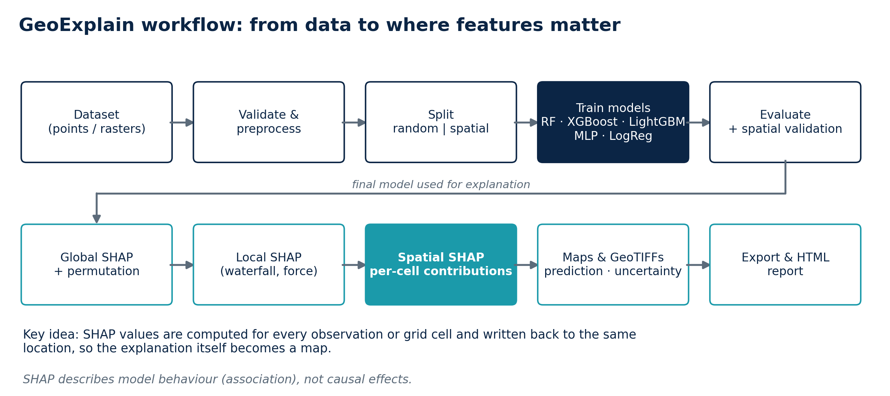
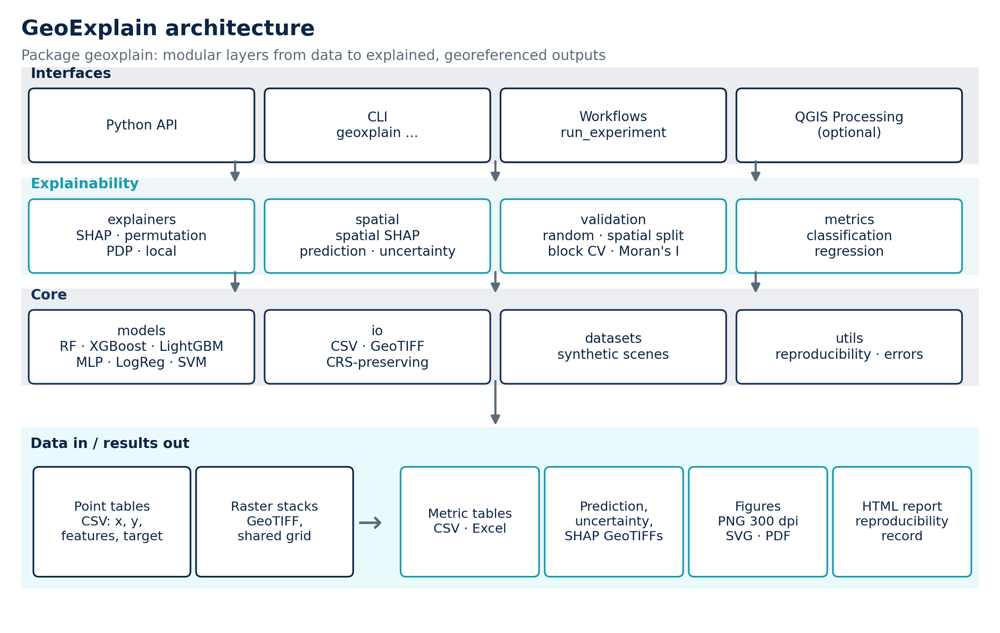
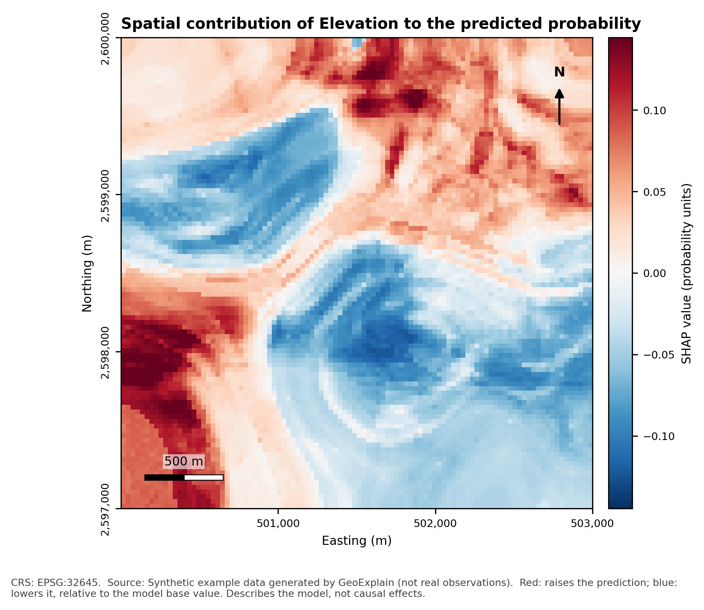
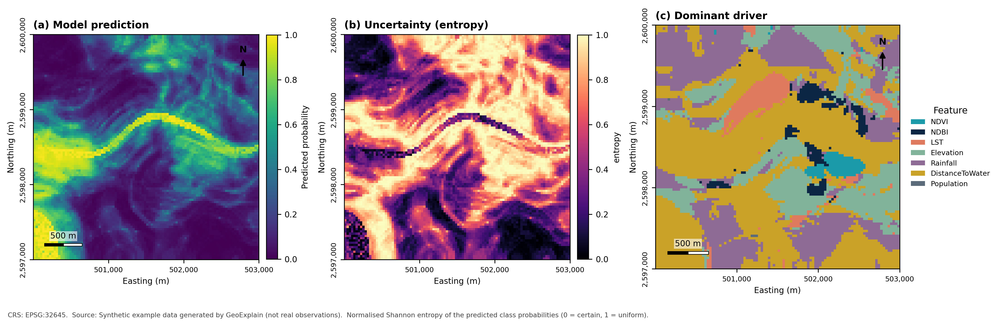
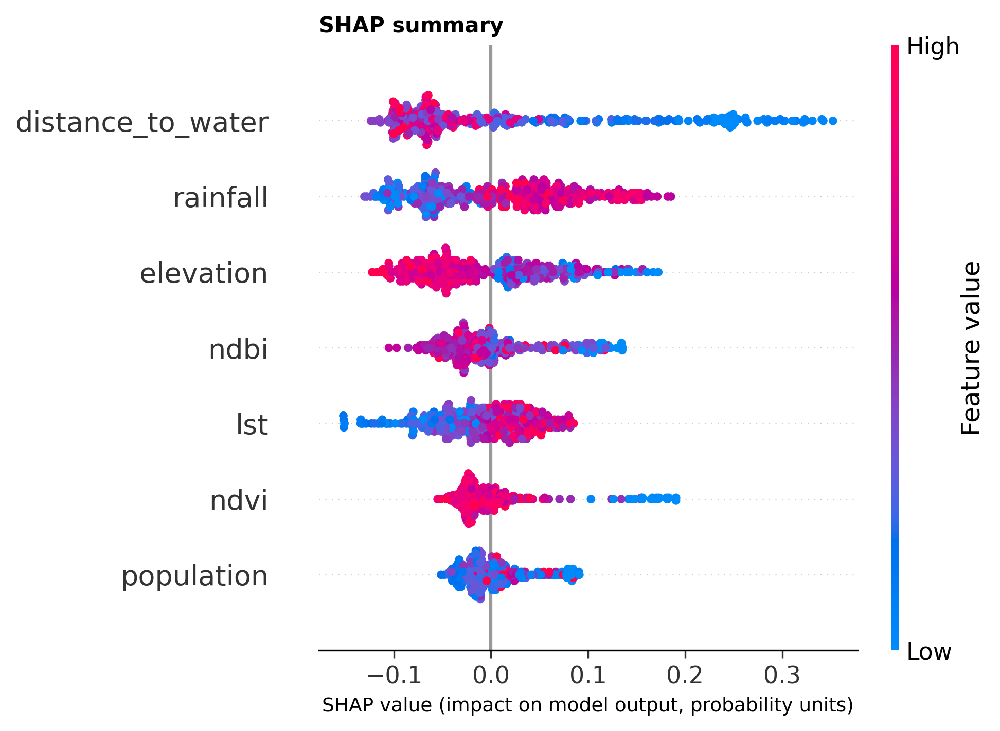
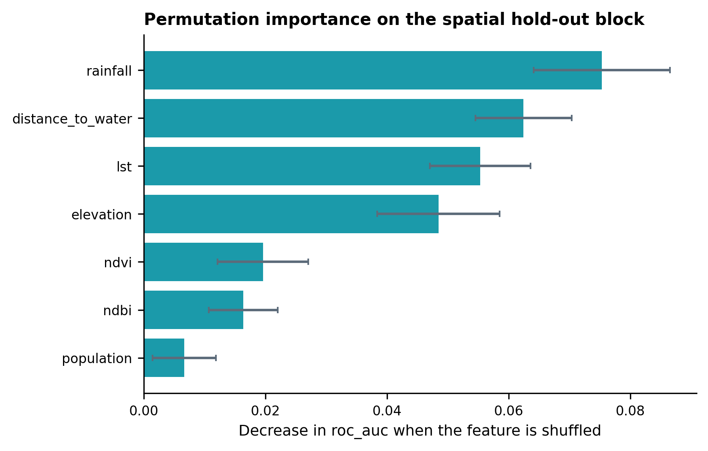
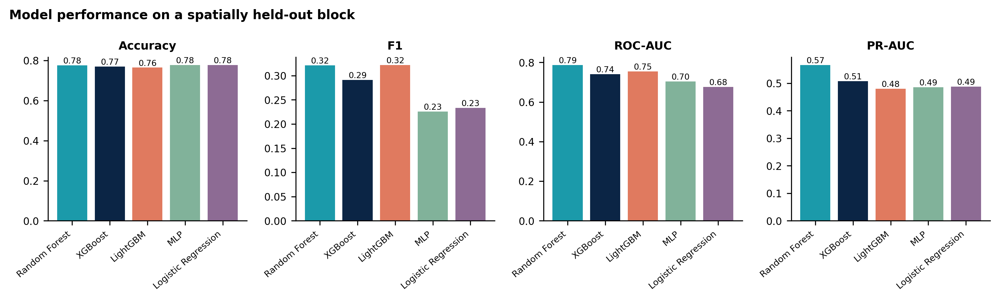
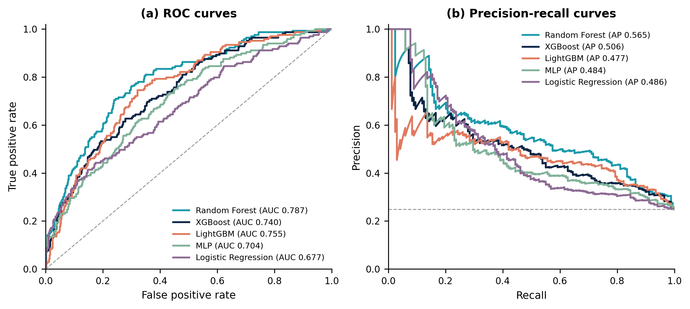

<p align="center">
  
</p>

## GeoExplain

**Explainable machine learning for geospatial prediction: it shows which variables matter, and *where* they matter.**

[](pyproject.toml)
[](LICENSE)
[](https://github.com/mdkhademali/GeoExplain/actions/workflows/tests.yml)
[](https://github.com/mdkhademali/GeoExplain/actions/workflows/lint.yml)
[-orange.svg)](CHANGELOG.md)

> **Initial research release (v0.1.0).** Not yet published on PyPI, conda-forge, the QGIS plugin repository or Zenodo. All example data and results in this repository are **synthetic**.

## Overview

GeoExplain is an open-source Python toolkit that trains geospatial machine-learning models, validates them with spatial cross-validation, and explains their predictions globally, locally and **spatially**. Its signature feature, *spatial SHAP*, computes a SHAP contribution for every observation or raster cell and writes it back as a georeferenced layer (`NDVI_SHAP.tif`, `Elevation_SHAP.tif`, ...), so the explanation itself becomes a map that preserves CRS, transform, size and nodata.



## Why GeoExplain?

* **Conventional explainability is aspatial.** A bar chart says elevation matters; it does not say *where* the model relies on elevation, or where the model is driven by something else entirely.
* **Random validation flatters geospatial models.** Neighbouring observations are similar, so random splits can overstate performance in new areas. GeoExplain puts random and spatial validation side by side.
* **Researcher-friendly.** One consistent API, a CLI, an HTML report and an optional QGIS provider, for people who know GIS and Python but are not software engineers.
* **Honest by design.** Every example number is computed by running the code; SHAP is documented as *model* behaviour, never causality.

## Key features

* Six models behind one interface: Random Forest, XGBoost, LightGBM, MLP, logistic regression (ridge for regression) and SVM; classification and regression
* Metrics: accuracy, precision, recall, F1, ROC-AUC, PR-AUC, confusion matrix; MAE, MSE, RMSE, R², MAPE; CSV and Excel export
* Spatial validation: random and spatial hold-out, spatial block k-fold with optional buffer, Moran's I, semivariogram
* Explainability: SHAP (summary, bar, dependence, waterfall, force), permutation importance, partial dependence / ICE
* **Spatial SHAP** GeoTIFFs, plus `prediction.tif`, `uncertainty.tif` (where supported) and a dominant-driver map
* Scientific maps with title, colour bar, north arrow, scale bar, coordinates, CRS and source note
* Model benchmarking (`geoxplain compare`), self-contained HTML report, reproducibility record
* Optional [QGIS Processing provider](docs/qgis.md) (experimental)

## Conceptual workflow

Dataset → validation/preprocessing → random & spatial splits → train models → evaluate → global/local SHAP → **spatial SHAP** → maps and GeoTIFFs → tables, figures and HTML report. See [docs/architecture.md](docs/architecture.md).



## Installation

```bash
git clone https://github.com/mdkhademali/GeoExplain.git   # or unzip GeoExplain_v0.1.0.zip
cd GeoExplain
pip install -e ".[dev]"
geoxplain --version
```

Python 3.10+; details and a conda recipe in [docs/installation.md](docs/installation.md).

## Quick start

```bash
geoxplain generate-data --out-dir data              # synthetic points + raster stack
python reproduce.py                                 # whole example: data, results, figures, report (~2 min)
```

```python
from geoxplain import GeoExplainModel, compute_spatial_shap, load_dataset, read_raster_stack

features = ["ndvi", "ndbi", "lst", "elevation", "rainfall", "distance_to_water", "population"]
ds = load_dataset("data/samples.csv", target="target", features=features, crs="EPSG:32645")
model = GeoExplainModel("random_forest", "classification").fit(ds.X, ds.y)

result = compute_spatial_shap(model, read_raster_stack("data/stack.tif"), background=ds.X.sample(100, random_state=0))
result.write("outputs/rasters")        # NDVI_SHAP.tif, Elevation_SHAP.tif, ..., prediction.tif, uncertainty.tif
```

Full walkthrough: [docs/quickstart.md](docs/quickstart.md) and [notebooks/01_end_to_end_workflow.ipynb](notebooks/01_end_to_end_workflow.ipynb).

## Spatial explainability

For each raster cell GeoExplain computes SHAP values and stores feature *i*'s contribution at the same cell of `<Feature>_SHAP.tif`. Red cells are places where the model uses that feature to *raise* the prediction, blue cells where it *lowers* it (colour scale symmetric about zero).




Outputs also include the prediction, a model-based uncertainty layer, and the *dominant driver* per cell:



Details, file list and caveats: [docs/spatial_explainability.md](docs/spatial_explainability.md).

## Example results

Everything below comes from `python reproduce.py` on **synthetic** data with a known generating process; it demonstrates the tooling, not real-world performance.

<!-- RESULTS:START -->
_Computed by `python reproduce.py` on synthetic data (2500 sampled points, seed 42, 5-fold CV, Python 3.12.3, scikit-learn 1.8.0, SHAP 0.52.0). Values come from actual execution; they describe artificial data and are not evidence about real-world performance._

**Random vs spatial cross-validation** (mean across folds):

| Model | ROC-AUC random CV | ROC-AUC spatial CV | PR-AUC random CV | PR-AUC spatial CV |
|---|---|---|---|---|
| Random Forest | 0.837 | 0.771 | 0.719 | 0.617 |
| XGBoost | 0.836 | 0.766 | 0.720 | 0.611 |
| LightGBM | 0.828 | 0.768 | 0.705 | 0.598 |
| MLP | 0.821 | 0.745 | 0.703 | 0.589 |
| Logistic Regression | 0.786 | 0.724 | 0.657 | 0.588 |

**Spatial hold-out block** (models trained on the remaining area):

| Model | Accuracy | F1 | ROC-AUC | PR-AUC |
|---|---|---|---|---|
| Random Forest | 0.776 | 0.321 | 0.787 | 0.567 |
| XGBoost | 0.771 | 0.291 | 0.740 | 0.508 |
| LightGBM | 0.765 | 0.322 | 0.755 | 0.480 |
| MLP | 0.778 | 0.226 | 0.704 | 0.486 |
| Logistic Regression | 0.778 | 0.234 | 0.677 | 0.488 |

**Spatial SHAP summary** (random forest, all valid grid cells):

| Feature | Mean abs SHAP (probability units) | Share of cells where dominant |
|---|---|---|
| distance_to_water | 0.0958 | 0.4558 |
| rainfall | 0.0644 | 0.2641 |
| elevation | 0.0539 | 0.1843 |
| lst | 0.0382 | 0.0471 |
| ndbi | 0.0371 | 0.0311 |
| ndvi | 0.0274 | 0.0172 |
| population | 0.0210 | 0.0004 |
<!-- RESULTS:END -->

| Global SHAP summary | Permutation importance (spatial hold-out) |
|---|---|
|  |  |

| Model performance (spatial hold-out) | ROC and PR curves |
|---|---|
|  |  |

The self-contained report is at `results/example_run/report.html`; more figures are in [`figures/`](figures/).

## Supported models

| Model | Classification | Regression | SHAP method |
|---|---|---|---|
| Random Forest | ✔ | ✔ | Tree (exact) |
| XGBoost | ✔ | ✔ | Tree (exact) |
| LightGBM | ✔ | ✔ | Tree (exact) |
| MLP | ✔ | ✔ | Permutation |
| Logistic regression / ridge | ✔ | ✔ (ridge) | Linear (exact) |
| SVM | ✔ | ✔ | Permutation |

See [docs/models.md](docs/models.md).

## Spatial validation

Random splits let test points sit next to near-identical training points; spatial block validation withholds whole areas.


GeoExplain measures the gap (`compare_validation_strategies(...).optimism()`) instead of assuming it. See [docs/spatial_validation.md](docs/spatial_validation.md).

## QGIS integration

An optional, experimental Processing provider (train, SHAP, spatial SHAP, compare, predict raster) lives in [`qgis/processing/`](qgis/processing/README.md). It is tested against a stubbed QGIS API only and has not been run in a live QGIS session. See [docs/qgis.md](docs/qgis.md).

## Documentation

[Installation](docs/installation.md) · [Quick start](docs/quickstart.md) · [Architecture](docs/architecture.md) · [Models](docs/models.md) · [Explainability](docs/explainability.md) · [Spatial explainability](docs/spatial_explainability.md) · [Spatial validation](docs/spatial_validation.md) · [Methodology](docs/methodology.md) · [QGIS](docs/qgis.md) · [CLI](docs/cli.md) · [API](docs/api.md) · [Examples](docs/examples.md) · [Reproducibility](docs/reproducibility.md) · [Limitations](docs/limitations.md)

## Reproducibility

`python reproduce.py` regenerates the data, results, figures and the tables above, and records seeds, parameters and package versions in `results/example_run/reproducibility.json`. See [docs/reproducibility.md](docs/reproducibility.md).

## Limitations

SHAP explains the *model*, not the world: it shows association and prediction, **not causal effects**. Spatial SHAP treats cells independently, uncertainty layers are not calibrated intervals, extrapolation beyond the training area is not flagged, and the QGIS provider is untested in live QGIS. Full list: [docs/limitations.md](docs/limitations.md).

## Citation

If you use GeoExplain, please cite it using [CITATION.cff](CITATION.cff) (GitHub's "Cite this repository" button):

> Ali, M. K. (2026). *GeoExplain: Explainable Machine Learning for Geospatial Prediction* (Version 0.1.0) [Computer software]. https://github.com/mdkhademali/GeoExplain

No DOI has been issued yet.

## Contributing

Contributions are welcome; see [CONTRIBUTING.md](CONTRIBUTING.md) and the [Code of Conduct](CODE_OF_CONDUCT.md). Report vulnerabilities as described in [SECURITY.md](SECURITY.md).

## License

GPL-3.0-or-later. See [LICENSE](LICENSE).
