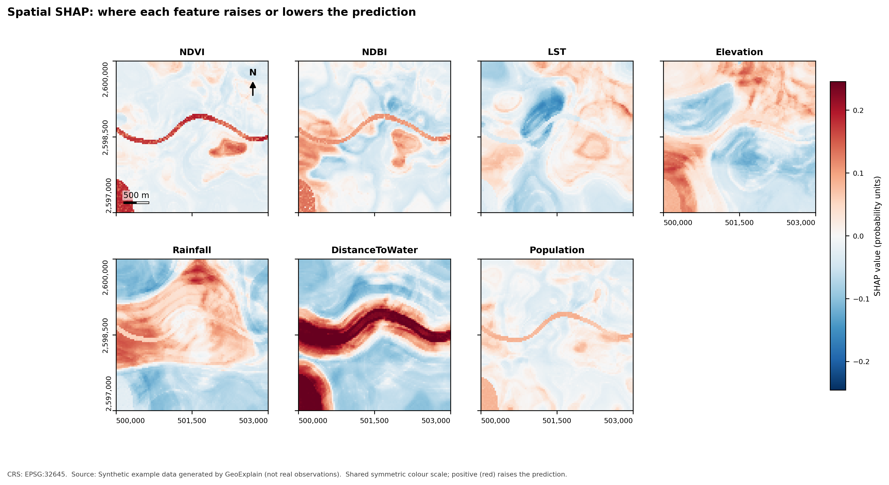
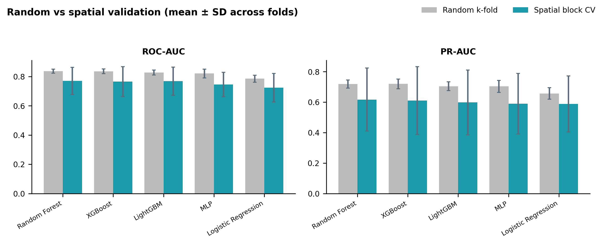

## Examples

Runnable scripts live in `examples/`; run them from the repository root after `python reproduce.py` (or `geoxplain generate-data --out-dir data`). The data are **synthetic** (see `data/README.md`).

| Folder | Shows |
|---|---|
| `examples/basic_classification/` | train a Random Forest, random vs spatial hold-out, CSV/Excel metric export |
| `examples/regression/` | regression on a continuous index, SHAP, spatial SHAP with Random Forest tree-spread uncertainty |
| `examples/spatial_explainability/` | the signature workflow: per-feature SHAP GeoTIFFs, CRS-preservation check, maps |
| `examples/model_comparison/` | four models, random vs spatial CV, explanation of the primary model, HTML report |
| `notebooks/01_end_to_end_workflow.ipynb` | the whole workflow in one notebook |

## Results of the reference run

Refreshed automatically by `reproduce.py` from the CSV outputs in `results/example_run/tables/`.

<!-- RESULTS:START -->
_Computed by `python reproduce.py` on synthetic data (2500 sampled points, seed 42, 5-fold CV, Python 3.12.3, scikit-learn 1.8.0, SHAP 0.52.0). Values come from actual execution; they describe artificial data and are not evidence about real-world performance._

**Random vs spatial cross-validation** (mean across folds):

| Model | ROC-AUC random CV | ROC-AUC spatial CV | PR-AUC random CV | PR-AUC spatial CV |
|---|---|---|---|---|
| Random Forest | 0.837 | 0.771 | 0.719 | 0.617 |
| XGBoost | 0.836 | 0.766 | 0.720 | 0.611 |
| LightGBM | 0.828 | 0.768 | 0.705 | 0.598 |
| MLP | 0.821 | 0.745 | 0.703 | 0.589 |
| Logistic Regression | 0.786 | 0.724 | 0.657 | 0.588 |

**Spatial hold-out block** (models trained on the remaining area):

| Model | Accuracy | F1 | ROC-AUC | PR-AUC |
|---|---|---|---|---|
| Random Forest | 0.776 | 0.321 | 0.787 | 0.567 |
| XGBoost | 0.771 | 0.291 | 0.740 | 0.508 |
| LightGBM | 0.765 | 0.322 | 0.755 | 0.480 |
| MLP | 0.778 | 0.226 | 0.704 | 0.486 |
| Logistic Regression | 0.778 | 0.234 | 0.677 | 0.488 |

**Spatial SHAP summary** (random forest, all valid grid cells):

| Feature | Mean abs SHAP (probability units) | Share of cells where dominant |
|---|---|---|
| distance_to_water | 0.0958 | 0.4558 |
| rainfall | 0.0644 | 0.2641 |
| elevation | 0.0539 | 0.1843 |
| lst | 0.0382 | 0.0471 |
| ndbi | 0.0371 | 0.0311 |
| ndvi | 0.0274 | 0.0172 |
| population | 0.0210 | 0.0004 |
<!-- RESULTS:END -->

## Figures

More figures: `figures/` (headline set) and `results/example_run/figures/` (all), plus the self-contained `results/example_run/report.html`.
